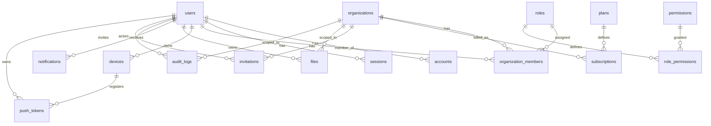

# ERD — Mobile SaaS Starter

> Detailed column-level ERD supplement to [`phase-0-technical-decisions.md`](./phase-0-technical-decisions.md) §4.
> Source of truth for `packages/database/src/schema.ts`.

## Visual

## Tables

### users
| col | type | constraints |
|---|---|---|
| id | text | pk, cuid2 |
| email | text | not null, unique (lowercased in app layer) |
| email_verified | boolean | not null, default false |
| name | text | not null |
| image | text | nullable (url) |
| created_at | timestamptz | not null, default now() |
| updated_at | timestamptz | not null, default now() |

### accounts
| col | type | constraints |
|---|---|---|
| id | text | pk |
| user_id | text | fk users.id cascade, indexed |
| provider | text | not null (`email` \| `google` \| `apple`) |
| provider_account_id | text | not null |
| password_hash | text | nullable (only for `email`) |
| created_at | timestamptz | not null |
| **unique** | | (provider, provider_account_id) |

### sessions
| col | type | constraints |
|---|---|---|
| id | text | pk |
| user_id | text | fk users.id cascade, indexed |
| token | text | not null, unique |
| expires_at | timestamptz | not null |
| ip_address | text | nullable |
| user_agent | text | nullable |
| created_at | timestamptz | not null |

### organizations
| col | type | constraints |
|---|---|---|
| id | text | pk |
| name | text | not null |
| slug | text | not null, unique |
| logo_url | text | nullable |
| created_at | timestamptz | not null |
| updated_at | timestamptz | not null |

### organization_members
| col | type | constraints |
|---|---|---|
| id | text | pk |
| organization_id | text | fk organizations.id cascade |
| user_id | text | fk users.id cascade |
| role | enum(role) | not null, default `member` |
| created_at | timestamptz | not null |
| **unique** | | (organization_id, user_id) |

### roles
| col | type | constraints |
|---|---|---|
| id | text | pk |
| key | text | unique (`owner` \| `admin` \| `member`) |
| name | text | not null |

### permissions
| col | type | constraints |
|---|---|---|
| id | text | pk |
| key | text | unique (e.g. `members.invite`) |
| description | text | not null |

### role_permissions
| col | type | constraints |
|---|---|---|
| role_id | text | fk roles.id cascade |
| permission_id | text | fk permissions.id cascade |
| **unique** | | (role_id, permission_id) |

Permissions seeded (V1): `organization.read`, `organization.update`, `organization.delete`, `members.read`, `members.invite`, `members.remove`, `members.update`, `billing.read`, `billing.manage`, `files.write`, `files.delete`.

### plans
| col | type | constraints |
|---|---|---|
| id | text | pk (`free` \| `pro` \| `enterprise`) |
| name | text | not null |
| price_cents | integer | not null |
| seats | integer | not null |
| provider | enum(provider) | not null, default `stripe` |
| provider_price_id | text | nullable |

### subscriptions
| col | type | constraints |
|---|---|---|
| id | text | pk |
| organization_id | text | fk organizations.id cascade, indexed |
| plan_id | text | fk plans.id |
| status | enum(subscription_status) | not null |
| provider | enum(provider) | not null |
| provider_subscription_id | text | nullable |
| current_period_end | timestamptz | nullable |
| created_at | timestamptz | not null |
| updated_at | timestamptz | not null |

### invitations
| col | type | constraints |
|---|---|---|
| id | text | pk |
| organization_id | text | fk organizations.id cascade |
| email | text | not null |
| role | enum(role) | not null, default `member` |
| token | text | not null, unique |
| invited_by | text | fk users.id |
| expires_at | timestamptz | not null |
| created_at | timestamptz | not null |

### devices
| col | type | constraints |
|---|---|---|
| id | text | pk |
| user_id | text | fk users.id cascade |
| platform | text | not null (`ios` \| `android` \| `web`) |
| app_version | text | nullable |
| created_at | timestamptz | not null |

### push_tokens
| col | type | constraints |
|---|---|---|
| id | text | pk |
| device_id | text | fk devices.id cascade |
| user_id | text | fk users.id cascade |
| token | text | not null, unique |
| provider | text | not null, default `expo` |
| created_at | timestamptz | not null |

### files
| col | type | constraints |
|---|---|---|
| id | text | pk |
| organization_id | text | fk organizations.id cascade, nullable |
| user_id | text | fk users.id cascade |
| key | text | not null, unique |
| url | text | not null |
| content_type | text | nullable |
| size | integer | nullable |
| created_at | timestamptz | not null |

### notifications
| col | type | constraints |
|---|---|---|
| id | text | pk |
| user_id | text | fk users.id cascade, indexed |
| title | text | not null |
| body | text | nullable |
| data | jsonb | nullable (deep link payload) |
| read_at | timestamptz | nullable |
| created_at | timestamptz | not null |

### audit_logs
| col | type | constraints |
|---|---|---|
| id | text | pk |
| organization_id | text | fk organizations.id set null, nullable, indexed |
| user_id | text | fk users.id set null, nullable, indexed |
| action | text | not null |
| target_type | text | nullable |
| target_id | text | nullable |
| metadata | jsonb | nullable |
| created_at | timestamptz | not null |

## Notes

- IDs are `cuid2` (`createId()` from `@paralleldrive/cuid2`) — sortable, JS-safe, no bigint.
- All `created_at`/`updated_at` managed by Drizzle defaults + triggers where needed.
- `email` uniqueness is enforced on lowercased value (app normalizes; add `citext` extension later if desired).
- `audit_logs` uses `set null` FKs so log survives user/org deletion.
- `notifications.data` and `audit_logs.metadata` are JSONB for flexible payloads; no strict schema in V1.
