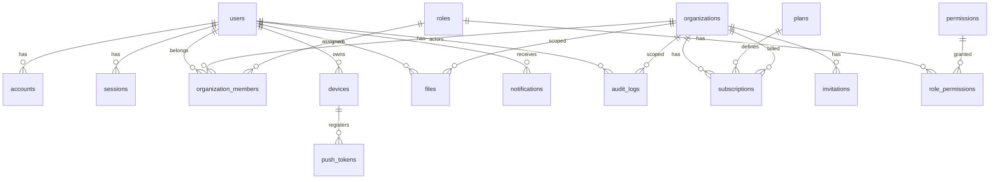

# Phase 0 — Technical Decisions & Database Design

**Project:** Mobile SaaS Starter (supastarter-expo)  
**Status:** Approved blueprint — ready for Phase 1  
**Date:** 2026-08-31  
**Owner:** BuildFast  
**Target:** `npx create-mobile-saas my-app` → production-ready Expo SaaS

> This document is the engineering blueprint referenced in spec §34. Every table, env var, and package edge here is what Phase 1 implements verbatim.

---

## 1) Decisions at a glance

| Domain | Decision | Alternative rejected | Why |
|---|---|---|---|
| **Mobile** | Expo SDK 57 + Expo Router v6 + TypeScript strict | Bare RN | EAS, OTA, managed native modules, file routing; bare RN buys nothing for a starter |
| **Monorepo** | pnpm + Turborepo (`apps/mobile` + `packages/*`) | npm workspaces alone | Incremental builds, remote cache, task graph; pnpm is the only store that keeps a 15-package monorepo cheap |
| **Database** | PostgreSQL 16 | SQLite / MySQL | JSONB, RLS patterns, `pgcrypto`/`citext`, Neon/Supabase ecosystem |
| **ORM** | Drizzle ORM | Prisma | No codegen daemon, real SQL, edge-deployable, migration SQL is readable and reviewable |
| **API** | **Hono + tRPC v11** (typed procedures over HTTP, REST fallback at `/api/rest/*` for webhooks/billing) | REST-only / GraphQL | End-to-end types without codegen, lightweight Hono server, REST kept for Stripe/Apple webhooks which cannot be tRPC |
| **Auth** | **Better Auth** (primary) + adapter seam for Clerk/Supabase | Clerk-only | Self-hosted, provider-agnostic, Expo scheme-compatible, DB-owned sessions; Clerk is a 1-file adapter if a customer prefers it |
| **Billing** | RevenueCat (StoreKit + Play Billing) + Stripe (web) behind `packages/billing` abstraction | Stripe-only | App Store Guideline 3.1.1 mandates IAP for digital goods; abstracting lets B2C/B2B/both coexist |
| **Storage** | S3-compatible (Cloudflare R2 primary) via presigned PUT | Direct S3 creds in app | No secrets on device; R2 egress cheaper than S3, same API |
| **Push** | `expo-notifications` + Expo Push Service → APNs/FCM | Firebase-only | Works with EAS credentials, single token path for iOS/Android |
| **Analytics** | PostHog abstraction (`analytics.track/identify/screen/reset`) | Vendor-hardcoded | `lib/analytics/index.ts` already abstracts; PostHog is self-host/Cloud, mobile SDK is mature |
| **Errors** | Sentry (`@sentry/react-native` + `@sentry/node` on API) | Bugsnag | Native crashes, breadcrumbs, releases, and EAS sourcemaps in one place |
| **Cache/State** | TanStack Query v5 + Zustand (device state only) | Redux Toolkit | Query cache handles server state; Zustand stays for theme/org/billing UI state already in the repo |
| **Deploys** | EAS Build + EAS Update, 3 profiles (`development`/`preview`/`production`) | Bare Fastlane | Credentials managed by EAS, OTA for JS updates, simulators-to-stores in one config |

Advisory Decision Records for each of these live in [`docs/adr/`](./adr/).

---

## 2) Product scope (spec §1–§2)

### 2.1 One-sentence promise

> Start with a production-ready mobile SaaS foundation instead of spending weeks building infrastructure.

### 2.2 Target customer (§26)

Solo developers, startup founders, small product teams, agencies, indie hackers building B2C or B2B SaaS with Expo who want `create → configure env → build features` instead of `create → rebuild auth/orgs/billing/notifications for weeks`.

### 2.3 MVP definition (§27)

**Foundation:** Expo + Router + TS strict + monorepo + UI tokens + env abstraction + typed API client + PostgreSQL.

**Auth:** email/password, verification, forgot/reset, Google, Apple, session restore, logout.

**SaaS:** users, organizations, members, RBAC, onboarding (`welcome → create-organization`).

**Mobile:** push, deep links, `expo-secure-store`, persistent query cache, dev builds + `eas.json`.

**Infra:** analytics abstraction, Sentry, Vitest + Playwright/Maestro, CI (lint/typecheck/test/build), docs.

**Deferred (explicitly out of scope §28):** offline mutation queue/sync, admin dashboard, AI marketplace, multi-region, Enterprise SSO, advanced 2FA, web/desktop companion apps.

---

## 3) Repository architecture (§4–§5)

### 3.1 Final folder structure

```
mobile-saas-starter/                       # repo root (this becomes create-mobile-saas template)
├── apps/
│   └── mobile/                            # ← current supastarter-expo migrates here
│       ├── src/
│       │   ├── app/
│       │   │   ├── _layout.tsx            # root: hydrate, appearance, i18n, Sentry init
│       │   │   ├── (auth)/{sign-in,sign-up,forgot-password,verify-email}.tsx
│       │   │   ├── (onboarding)/{welcome,create-organization}.tsx
│       │   │   └── (app)/{_layout,index,settings,profile,organization,billing}.tsx
│       │   ├── components/
│       │   ├── features/                  # per-screen feature hooks (calls packages/api)
│       │   ├── hooks/                     
│       │   ├── lib/                        # re-exports from packages/* (thin shims during migration)
│       │   └── providers/
│       ├── app.config.ts
│       ├── eas.json
│       └── package.json
├── packages/
│   ├── api/           # Hono + tRPC router, client, procedure defs
│   ├── auth/          # Better Auth config + Expo OAuth helpers
│   ├── database/      # Drizzle schema, migrations, seed, db client
│   ├── organizations/ # org service + helpers
│   ├── permissions/   # RBAC definitions + can() helper
│   ├── billing/       # abstraction: getProducts/purchase/restore/getSubscription
│   ├── notifications/ # push token + notification service
│   ├── storage/       # presigned URL service (R2/S3)
│   ├── analytics/     # track/identify/screen/reset
│   ├── config/        # env schema (zod), public vs private split
│   ├── types/         # shared TS types (PlanId, Role, etc.)
│   └── ui/            # design system (migrated from ui/index.tsx)
├── tooling/
│   ├── eslint/
│   ├── prettier/
│   └── typescript/
├── docs/
│   ├── phase-0-technical-decisions.md  # this file
│   ├── adr/
│   └── erd.md
├── package.json
├── pnpm-workspace.yaml
├── turbo.json
└── README.md
```

> **Migration path:** Phase 1 Day 1–4 moves the current `supastarter-expo/*` into `apps/mobile/src/*` and extracts `lib/*` → `packages/*` without breaking imports (barrel re-exports). No API surface change for screens.

### 3.2 Workspace config

**`pnpm-workspace.yaml`**
```yaml
packages:
  - "apps/*"
  - "packages/*"
  - "tooling/*"
```

**`turbo.json`**
```json
{
  "$schema": "https://turbo.build/schema.json",
  "tasks": {
    "build":     { "dependsOn": ["^build"], "outputs": ["dist/**"] },
    "typecheck": { "dependsOn": ["^build"] },
    "lint":      {},
    "test":      { "dependsOn": ["^build"] }
  }
}
```

### 3.3 Package dependency graph

```
apps/mobile
  → @repo/ui
  → @repo/api        (client)
  → @repo/auth       (client helpers)
  → @repo/config
  → @repo/types
  → @repo/analytics
  → @repo/billing    (client abstraction)
  → @repo/storage    (presign helpers)

packages/api         (server)
  → @repo/database
  → @repo/auth
  → @repo/organizations
  → @repo/permissions
  → @repo/billing
  → @repo/notifications
  → @repo/storage
  → @repo/config
  → @repo/types

packages/auth        → @repo/database, @repo/config
packages/organizations → @repo/database, @repo/permissions
packages/billing     → @repo/database, @repo/config
packages/notifications → @repo/database
packages/storage     → @repo/config
packages/ui          → (no internal deps)
packages/config      → (leaf)
packages/types       → (leaf)
```

**Rule:** No cycle may point upward (`packages/*` must never import `apps/mobile`). Enforced with `eslint-plugin-import` + `depcheck`.

---

## 4) Database architecture (§8)

### 4.1 ERD (Mermaid)



Full ERD with columns lives in [`docs/erd.md`](./erd.md).

### 4.2 Core tables — Drizzle schema (authoritative)

> File: `packages/database/src/schema.ts`. All IDs are `text` (`cuid2`) to keep Expo/JS runtimes free of bigint coercion. Timestamps are `timestamp with time zone`. Enums are Postgres enums.

```ts
// packages/database/src/schema.ts (excerpt — complete file ~220 lines in Phase 1)
import { pgTable, text, timestamp, pgEnum, boolean, integer, jsonb, index, uniqueIndex } from 'drizzle-orm/pg-core';
import { relations } from 'drizzle-orm';

export const roleEnum = pgEnum('role', ['owner','admin','member']);
export const planEnum = pgEnum('plan', ['free','pro','enterprise']);
export const subscriptionStatusEnum = pgEnum('subscription_status', ['active','past_due','canceled','trialing','incomplete']);
export const providerEnum = pgEnum('provider', ['apple','google','stripe','revenuecat']);

export const users = pgTable('users', {
  id: text('id').primaryKey(),
  email: text('email').notNull(),
  emailVerified: boolean('email_verified').notNull().default(false),
  name: text('name').notNull(),
  image: text('image'),
  createdAt: timestamp('created_at', { withTimezone: true }).notNull().defaultNow(),
  updatedAt: timestamp('updated_at', { withTimezone: true }).notNull().defaultNow(),
}, (t) => [uniqueIndex('users_email_uidx').on(t.email)]);

export const accounts = pgTable('accounts', {
  id: text('id').primaryKey(),
  userId: text('user_id').notNull().references(() => users.id, { onDelete: 'cascade' }),
  provider: text('provider').notNull(), // 'email' | 'google' | 'apple'
  providerAccountId: text('provider_account_id').notNull(),
  passwordHash: text('password_hash'),   // only for provider='email'
  createdAt: timestamp('created_at', { withTimezone: true }).notNull().defaultNow(),
}, (t) => [uniqueIndex('accounts_provider_uidx').on(t.provider, t.providerAccountId), index('accounts_user_idx').on(t.userId)]);

export const sessions = pgTable('sessions', {
  id: text('id').primaryKey(),
  userId: text('user_id').notNull().references(() => users.id, { onDelete: 'cascade' }),
  token: text('token').notNull(),
  expiresAt: timestamp('expires_at', { withTimezone: true }).notNull(),
  ipAddress: text('ip_address'),
  userAgent: text('user_agent'),
  createdAt: timestamp('created_at', { withTimezone: true }).notNull().defaultNow(),
}, (t) => [uniqueIndex('sessions_token_uidx').on(t.token), index('sessions_user_idx').on(t.userId)]);

export const organizations = pgTable('organizations', {
  id: text('id').primaryKey(),
  name: text('name').notNull(),
  slug: text('slug').notNull(),
  logoUrl: text('logo_url'),
  createdAt: timestamp('created_at', { withTimezone: true }).notNull().defaultNow(),
  updatedAt: timestamp('updated_at', { withTimezone: true }).notNull().defaultNow(),
}, (t) => [uniqueIndex('orgs_slug_uidx').on(t.slug)]);

export const organizationMembers = pgTable('organization_members', {
  id: text('id').primaryKey(),
  organizationId: text('organization_id').notNull().references(() => organizations.id, { onDelete: 'cascade' }),
  userId: text('user_id').notNull().references(() => users.id, { onDelete: 'cascade' }),
  role: roleEnum('role').notNull().default('member'),
  createdAt: timestamp('created_at', { withTimezone: true }).notNull().defaultNow(),
}, (t) => [uniqueIndex('org_members_org_user_uidx').on(t.organizationId, t.userId), index('org_members_user_idx').on(t.userId)]);

export const roles = pgTable('roles', {
  id: text('id').primaryKey(),
  key: text('key').notNull().unique(), // 'owner' | 'admin' | 'member'
  name: text('name').notNull(),
});

export const permissions = pgTable('permissions', {
  id: text('id').primaryKey(),
  key: text('key').notNull().unique(), // 'organization.update', 'members.invite', ...
  description: text('description').notNull(),
});

export const rolePermissions = pgTable('role_permissions', {
  roleId: text('role_id').notNull().references(() => roles.id, { onDelete: 'cascade' }),
  permissionId: text('permission_id').notNull().references(() => permissions.id, { onDelete: 'cascade' }),
}, (t) => [uniqueIndex('role_perm_uidx').on(t.roleId, t.permissionId)]);

export const plans = pgTable('plans', {
  id: text('id').primaryKey(), // 'free' | 'pro' | 'enterprise'
  name: text('name').notNull(),
  priceCents: integer('price_cents').notNull(),
  seats: integer('seats').notNull(),
  provider: providerEnum('provider').notNull().default('stripe'),
  providerPriceId: text('provider_price_id'),
});

export const subscriptions = pgTable('subscriptions', {
  id: text('id').primaryKey(),
  organizationId: text('organization_id').notNull().references(() => organizations.id, { onDelete: 'cascade' }),
  planId: text('plan_id').notNull().references(() => plans.id),
  status: subscriptionStatusEnum('status').notNull(),
  provider: providerEnum('provider').notNull(),
  providerSubscriptionId: text('provider_subscription_id'),
  currentPeriodEnd: timestamp('current_period_end', { withTimezone: true }),
  createdAt: timestamp('created_at', { withTimezone: true }).notNull().defaultNow(),
  updatedAt: timestamp('updated_at', { withTimezone: true }).notNull().defaultNow(),
}, (t) => [index('subs_org_idx').on(t.organizationId)]);

export const invitations = pgTable('invitations', {
  id: text('id').primaryKey(),
  organizationId: text('organization_id').notNull().references(() => organizations.id, { onDelete: 'cascade' }),
  email: text('email').notNull(),
  role: roleEnum('role').notNull().default('member'),
  token: text('token').notNull().unique(),
  invitedBy: text('invited_by').notNull().references(() => users.id),
  expiresAt: timestamp('expires_at', { withTimezone: true }).notNull(),
  createdAt: timestamp('created_at', { withTimezone: true }).notNull().defaultNow(),
});

export const devices = pgTable('devices', {
  id: text('id').primaryKey(),
  userId: text('user_id').notNull().references(() => users.id, { onDelete: 'cascade' }),
  platform: text('platform').notNull(), // 'ios' | 'android' | 'web'
  appVersion: text('app_version'),
  createdAt: timestamp('created_at', { withTimezone: true }).notNull().defaultNow(),
});

export const pushTokens = pgTable('push_tokens', {
  id: text('id').primaryKey(),
  deviceId: text('device_id').notNull().references(() => devices.id, { onDelete: 'cascade' }),
  userId: text('user_id').notNull().references(() => users.id, { onDelete: 'cascade' }),
  token: text('token').notNull().unique(),
  provider: text('provider').notNull().default('expo'), // 'expo' | 'fcm' | 'apns'
  createdAt: timestamp('created_at', { withTimezone: true }).notNull().defaultNow(),
});

export const files = pgTable('files', {
  id: text('id').primaryKey(),
  organizationId: text('organization_id').references(() => organizations.id, { onDelete: 'cascade' }),
  userId: text('user_id').notNull().references(() => users.id, { onDelete: 'cascade' }),
  key: text('key').notNull().unique(),
  url: text('url').notNull(),
  contentType: text('content_type'),
  size: integer('size'),
  createdAt: timestamp('created_at', { withTimezone: true }).notNull().defaultNow(),
});

export const notifications = pgTable('notifications', {
  id: text('id').primaryKey(),
  userId: text('user_id').notNull().references(() => users.id, { onDelete: 'cascade' }),
  title: text('title').notNull(),
  body: text('body'),
  data: jsonb('data'),
  readAt: timestamp('read_at', { withTimezone: true }),
  createdAt: timestamp('created_at', { withTimezone: true }).notNull().defaultNow(),
}, (t) => [index('notifs_user_idx').on(t.userId)]);

export const auditLogs = pgTable('audit_logs', {
  id: text('id').primaryKey(),
  organizationId: text('organization_id').references(() => organizations.id, { onDelete: 'set null' }),
  userId: text('user_id').references(() => users.id, { onDelete: 'set null' }),
  action: text('action').notNull(),
  targetType: text('target_type'),
  targetId: text('target_id'),
  metadata: jsonb('metadata'),
  createdAt: timestamp('created_at', { withTimezone: true }).notNull().defaultNow(),
}, (t) => [index('audit_org_idx').on(t.organizationId), index('audit_user_idx').on(t.userId)]);
```

**Seed data (Phase 1):** 3 roles, ~10 permissions (see §6), 3 plans, 1 demo org.

**Migrations:** `drizzle-kit generate` → `packages/database/drizzle/*.sql`, applied via `drizzle-kit push` in CI and `migrate()` on API boot.

### 4.3 Key constraints & indexes

- `users(email)` citext-like: app normalizes to lowercase; unique index enforces it.
- `organization_members(organization_id, user_id)` unique — a user has exactly one role per org.
- `sessions(token)` unique + short TTL (Better Auth default 30d sliding).
- `invitations(token)` unique + expiry check in service (7d).
- `push_tokens(token)` unique — dedup across reinstall.

---

## 5) Authentication architecture (§7)

### 5.1 Provider: Better Auth

**Why it wins for a starter:** database-owned sessions (no vendor JWT lock-in), PostgreSQL-native, email+OAuth+Apple in one config, drop-in Expo companion via `expo-auth-session` redirect scheme. Clerk and Supabase remain supported through adapter seam.

```
Expo App  ──HTTPS──►  Hono + Better Auth  ──►  PostgreSQL (sessions)
    │                       │
    │  SecureStore          │  email verification / reset via Resend
    │  auth token           │  Google/Apple OAuth (expo-auth-session)
    │  (session cookie)     │
```

**Flows V1:** email/password, email verification, forgot/reset, Google, Apple, logout, session restoration (SecureStore hydration already implemented in `lib/auth-store.ts`).

**Planned:** magic links, passkeys (Better Auth plugins), 2FA/TOTP, biometrics (local device unlock via `expo-local-authentication`, not a server session factor).

**Expo gotcha:** OAuth needs a development build (`npx expo prebuild` + `app.config.ts` `scheme`) — Expo Go cannot register custom redirect schemes. Documented in onboarding docs; `app.config.ts` already sets `scheme: "supastarter"`.

### 5.2 Client seam (what screens import)

```ts
// packages/auth/src/client.ts — replaces lib/auth-store.ts internals
export type AuthClient = {
  signIn(email: string, password: string): Promise<User>;
  signUp(name: string, email: string, password: string): Promise<User>;
  signInWithGoogle(): Promise<User>;
  signInWithApple(): Promise<User>;
  signOut(): Promise<void>;
  getSession(): Promise<Session | null>;
};
```

Screens never import `better-auth/*` directly. Swapping to Clerk is a new file implementing `AuthClient`.

### 5.3 Session storage

- Sensitive token/session → `expo-secure-store` (already used).
- Non-sensitive cache (orgs, billing plan) → `AsyncStorage`.
- API `Authorization: Bearer <token>` set by `setAuthToken` in `lib/api/client.ts`.

---

## 6) Organization & permissions architecture (§9–§10)

### 6.1 Membership model

A user belongs to many organizations; an organization has many members; each membership has exactly one `Role`. The spec's `permissions` are strings enforced server-side via `can(user, orgId, permission)`.

### 6.2 Roles & permissions matrix (V1)

| Permission | `owner` | `admin` | `member` |
|---|:---:|:---:|:---:|
| `organization.read` | ✓ | ✓ | ✓ |
| `organization.update` | ✓ | ✓ |  |
| `organization.delete` | ✓ |  |  |
| `members.read` | ✓ | ✓ | ✓ |
| `members.invite` | ✓ | ✓ |  |
| `members.remove` | ✓ | ✓ |  |
| `members.update` (change role) | ✓ |  |  |
| `billing.read` | ✓ | ✓ | ✓ |
| `billing.manage` | ✓ |  |  |
| `files.write` | ✓ | ✓ | ✓ |
| `files.delete` | ✓ | ✓ |  |

`packages/permissions/src/index.ts` exports:

```ts
export const permissions = [
  'organization.read','organization.update','organization.delete',
  'members.read','members.invite','members.remove','members.update',
  'billing.read','billing.manage','files.write','files.delete',
] as const;

export function can(role: Role, permission: Permission): boolean { /* matrix lookup */ }
export function assertCan(role: Role, permission: Permission): void { /* throws 403 */ }
```

**Enforcement:** every tRPC procedure that takes `organizationId` resolves the caller's membership, maps `role → permissions`, and throws `TRPCError({ code: 'FORBIDDEN' })` before touching business logic. Client mirrors with `useCan(permission)` to hide UI only.

### 6.3 Invitations

`POST /trpc/invitations.create` → creates `invitations` row with `token` (cryptographic, 48 hex chars, 7d expiry) + sends email (Resend). Accept via deep link `myapp://invite/<token>` → `POST /trpc/invitations.accept` which creates `organization_members`.

---

## 7) API architecture (§11–§12)

### 7.1 Stack: Hono + tRPC v11

```
apps/mobile  ─fetch─►  Hono app
                        ├─ /trpc/*           (tRPC handler, auth middleware)
                        ├─ /api/rest/*       (REST for Stripe/Apple webhooks, health)
                        └─ /api/auth/*       (Better Auth handler, mounted as Hono route)
```

- **tRPC router** lives in `packages/api/src/router.ts`, procedures split by domain (`auth.ts`, `organizations.ts`, `members.ts`, `billing.ts`, `notifications.ts`, `files.ts`).
- **Context** (`createContext({ req })`) hydrates `session.user` from Better Auth cookie/header + `orgId` from `x-organization-id` (set by client from `useOrgs().activeOrgId`). No `orgId` in URL path — avoids enumeration.
- **Client** (`packages/api/src/client.ts`) wraps `@trpc/client` with `httpBatchLink` + `superjson`, reuses `getAuthToken()` for header injection. Hooks: `useQuery`/`useMutation` thin wrappers over TanStack Query to keep the current `lib/api/hooks.ts` shape — consumers keep `useOrganizations()` etc., implementation swaps to tRPC underneath.

### 7.2 Typed contract example

```ts
// packages/api/src/procedures/organizations.ts
export const organizationsRouter = router({
  list: protectedProcedure.query(({ ctx }) =>
    db.query.organizationMembers.findMany({ where: eq(organizationMembers.userId, ctx.user.id) })
  ),
  create: protectedProcedure.input(z.object({ name: z.string().min(2) }))
    .mutation(async ({ ctx, input }) => { /* create org + owner membership */ }),
  update: protectedProcedure.input(z.object({ organizationId: z.string(), name: z.string().min(2) }))
    .use(enforce('organization.update'))
    .mutation(async ({ input }) => { /* update */ }),
});
```

### 7.3 Data fetching on the client

```
Screen → useOrganizations() [features hook] → trpc.organizations.list.useQuery() → TanStack Query cache → Hono/tRPC → Postgres
```

- **Server state:** TanStack Query (persistent cache via `@tanstack/query-persist-client` + AsyncStorage).
- **Local state:** Zustand only for actual device/UI state (theme, active org, billing plan). Already implemented.

---

## 8) Billing architecture (§14)

### 8.1 Abstraction

```
packages/billing
├── core/       # PlanId, Plan, getPlans() — single source of truth (migrated from lib/billing/plans.ts)
├── apple/      # InAppPurchases via expo-in-app-purchases / RevenueCat
├── google/     # Play Billing via same SDK
├── stripe/     # Stripe Checkout + Billing Portal via expo-web-browser
└── index.ts    # unified interface:
                # getProducts(), purchase(planId), restorePurchases(), getSubscription(orgId), cancel()
```

### 8.2 Provider strategy decision (Phase 0)

Support **both B2C and B2B**:

- **Mobile-purchased digital subscriptions** → RevenueCat (wraps StoreKit + Play Billing, webhook → `subscriptions` row with `provider='revenuecat'`).
- **Web/organization-billed seats** → Stripe Checkout (web) via `POST /api/rest/billing/checkout` → Stripe, webhook at `POST /api/rest/webhooks/stripe` → `subscriptions` row with `provider='stripe'`.
- The `billing.manage` permission gates who can invoke checkout/portal; `billing.read` gates who can see plan status.

**Why not hardcode Stripe in screens:** App Store will reject an app that routes digital subscriptions around IAP. The abstraction keeps IAP and web paths auditable separately.

### 8.3 Entitlement

`subscriptions` is org-scoped. `useBilling()` resolves `activeOrgId → subscriptions` and exposes `plan`, `status`, `isPro`. Gating is server-enforced (middleware checks `subscription.status === 'active'` when a procedure requires a paid feature).

---

## 9) Push, deep linking, offline, storage, analytics, errors

### 9.1 Push notifications (§15)

```
Backend (trpc.notifications.send / cron) → Notification Service (packages/notifications)
  → Expo Push Service → APNs / FCM → Device
```

- Device registers on login/app start: `devices` row + `pushTokens` row (provider=`'expo'`).
- `expo-notifications` installed in Phase 1 Day 6 (adds config plugin + permissions).
- Preferences stored in `users` JSONB column `notificationPreferences` (V1: `{ marketing: boolean; transactional: boolean }`).
- Notification history in `notifications` table; deep link payload in `data: { url: "myapp://..." }`.
- Tap → `expo-notifications` listener → `router.push(data.url)`.
- Server endpoint `POST /api/rest/webhooks/expo` handles receipts/bounces.

### 9.2 Deep linking (§16)

- **Scheme:** `supastarter://` (configurable via `EXPO_PUBLIC_SCHEME`, already `supastarter` in `app.json`).
- **Expo Router:** `app.config.ts` `scheme` + `expo-linking` prefix = `supastarter://` + Universal Links later (`associatedDomains` / `intentFilters`).
- Supported paths (§16 list):
  ```
  supastarter://invite/<token>
  supastarter://organization/<slug>
  supastarter://settings
  supastarter://billing
  supastarter://post/<id>   (placeholder for product content)
  ```
- Behavior matrix (handled in `app/_layout.tsx` linking handler added Phase 1):
  | App state | Auth state | Result |
  |---|---|---|
  | closed | unauthenticated | store pending URL in SecureStore, open after onboarding |
  | backgrounded | authenticated | `router.push` directly |
  | foreground | any | handle via `useURL` + `Linking.addEventListener` |

### 9.3 Offline (§17)

**V1 (MVP):**
- TanStack Query persistent cache (`createPersister` → AsyncStorage) — screens render stale data when offline.
- `NetInfo` banner + `queryClient` retry with exponential backoff (`retry: 3, retryDelay: attempt => 1000 * 2 ** attempt`).
- Mutations fail visibly; no silent queue.

**V2 (post-MVP):** mutation queue + `offlineMutations` table on device + sync/conflict strategy. Explicitly deferred — no V2 code in MVP.

### 9.4 Storage (§18)

```
Expo (ImagePicker) → POST /trpc/files.presign { contentType, fileName, orgId }
  → { uploadUrl, key, publicUrl }           (server signs R2/S3 PUT)
  → PUT uploadUrl (raw bytes, no auth header)
  → server validates key on next read, stores row in files
```

- No long-lived credentials on device.
- Keys namespaced: `org/<orgId>/<userId>/<cuid2>-<filename>`.
- Variants/thumbnails deferred; raw upload only for V1.

### 9.5 Analytics (§19)

The implemented `@repo/analytics` facade keeps screens/provider code decoupled, uses a typed `lower_snake_case` catalog, and exposes separate client-safe and server-only exports. The client initializes from public `EXPO_PUBLIC_POSTHOG_KEY`/`EXPO_PUBLIC_POSTHOG_HOST` only; the server provider reads private `POSTHOG_SERVER_KEY` only through `@repo/analytics/server`.

The authenticated internal user ID is the distinct ID. Raw email, full name, phone, address, credentials, invitation tokens, signed URLs, and arbitrary nested metadata are rejected or omitted. `user_preferences.analytics_enabled` is separate from `marketing_opt_in`; consent is loaded before authenticated analytics, and disablement resets provider identity.

V1 product events use one convention, `lower_snake_case`, including `user_signed_up`, `user_signed_in`, `user_signed_out`, `organization_created`, `invitation_accepted`, `notification_opened`, `settings_updated`, and `storage_upload_completed`. Screen tracking occurs at the Expo Router boundary and sanitizes dynamic paths such as invitation-token routes to logical names.

### 9.6 Error monitoring (§20)

- `@sentry/react-native` in `apps/mobile` (init in `app/_layout.tsx` before hydration), `@sentry/node` on Hono server.
- Centralized: one `Sentry.init` in app, one on API. Breadcrumbs auto-capture, `Sentry.captureException` only in `api/client.ts` interceptor and tRPC error formatter.
- Releases tracked via `SENTRY_RELEASE` from `eas.json` `env` + sourcemaps upload in `eas build` hook.
- No scattered `try/catch + console.error` per screen.

---

## 10) Environment strategy (§22)

### 10.1 Separation

| Scope | Exposure | Examples |
|---|---|---|
| `EXPO_PUBLIC_*` | Bundled into JS, visible on device | `EXPO_PUBLIC_API_URL`, `EXPO_PUBLIC_POSTHOG_KEY`, `EXPO_PUBLIC_SCHEME` |
| Private (server only) | Never bundled | `DATABASE_URL`, `BETTER_AUTH_SECRET`, `RESEND_API_KEY`, `S3_*`, `STRIPE_*`, `SENTRY_DSN_SERVER` |

Validation: `packages/config/src/env.ts` uses `zod` to parse and throw at boot if required vars are missing. Importing `config` on the server asserts private vars are present; client bundle tree-shakes them away.

### 10.2 Files

```
.env.development   # points at local Postgres + local Hono (http://localhost:3000)
.env.preview       # preview EAS + preview API (e.g. Fly / Render preview env)
.env.production    # production API + secrets injected via EAS secrets, not committed
.env.example       # committed, documents every key with dummy values
```

No `.env` is committed except `.env.example`. EAS secrets (`eas secret:create`) hold production private vars.

### 10.3 Required vars (Phase 1)

```
# public (client + server)
EXPO_PUBLIC_API_URL          # https://api.example.com
EXPO_PUBLIC_POSTHOG_KEY
EXPO_PUBLIC_POSTHOG_HOST
EXPO_PUBLIC_SENTRY_DSN
EXPO_PUBLIC_SCHEME           # supastarter
EXPO_PUBLIC_AI_MODEL         # already in config.ts

# private (server only)
DATABASE_URL                 # postgres://...
BETTER_AUTH_SECRET           # 32+ random bytes
BETTER_AUTH_URL              # https://api.example.com
RESEND_API_KEY               # email
S3_ENDPOINT                  # https://<account>.r2.cloudflarestorage.com
S3_BUCKET
S3_ACCESS_KEY_ID
S3_SECRET_ACCESS_KEY
S3_PUBLIC_BASE_URL           # https://files.example.com
STRIPE_SECRET_KEY
STRIPE_WEBHOOK_SECRET
REVENUECAT_WEBHOOK_SECRET
SENTRY_DSN_SERVER
```

---

## 11) EAS architecture (§21)

### 11.1 `eas.json`

```json
{
  "cli": { "version": ">= 13.0.0" },
  "build": {
    "development": {
      "developmentClient": true,
      "distribution": "internal",
      "channel": "development",
      "env": { "EXPO_PUBLIC_API_URL": "http://localhost:3000" }
    },
    "preview": {
      "distribution": "internal",
      "channel": "preview"
    },
    "production": {
      "channel": "production",
      "autoIncrement": true
    }
  },
  "submit": {
    "production": {}
  }
}
```

### 11.2 Workflow

```
Developer → git push → CI (lint/typecheck/test/build)
  → EAS Build (development) on PR (internal APK/TestFlight)
  → EAS Build (preview) on main
  → EAS Build (production) + Submit on tag/release
  → EAS Update (OTA) for JS-only changes on preview/production
```

- Dev builds required for OAuth, notifications, and any native module (Better Auth callbacks, `expo-notifications`, future `expo-local-authentication`). Expo Go stays viable only for UI-only iteration.

---

## 12) Testing & CI/CD (§23–§24)

### 12.1 Layers

```
Unit (Vitest)           — lib helpers, can(), plan logic, billing math
Integration (Vitest)    — tRPC procedures against test Postgres (docker)
API (Supertest)         — Hono endpoints, webhook signature verification
E2E (Maestro)           — sign up → onboarding → invite → billing → push → deep link → offline
Device (EAS + Maestro)  — same flows on simulator + physical device (nightly)
```

**E2E scenarios (must pass before release):** sign-up, sign-in, sign-out, password reset, create organization, invite member, switch organization, subscription purchase/restore, push notification, deep link (all 5 app states), offline banner.

### 12.2 CI

**Every PR:**
```
pnpm install --frozen-lockfile
pnpm lint
pnpm typecheck         # tsc --noEmit in every package + app
pnpm test              # unit + integration (postgres service)
pnpm build             # expo export + api build
```

**Main:**
`+ eas build --profile preview --non-interactive --no-wait`

**Release (tag `v*`):**
`eas build --profile production --auto-submit`

GitHub Actions workflow lives in `.github/workflows/ci.yml` (Phase 1 Day 10).

---

## 13) Navigation architecture (§6)

Already correctly implemented with Expo Router route groups:

```
app/
  _layout.tsx            # hydration + Stack
  (marketing)/           # public
  (auth)/                # logged-out
  onboarding/            # post-signup pre-app gate
  (app)/                 # logged-in gate (redirects to /sign-in if no user)
    _layout.tsx          # Tabs + org switcher
    (tabs)/{home,team,billing,settings}
    assistant.tsx
```

**Gate logic (already in `(app)/_layout.tsx`, keep):**

```
if (!user) → /sign-in
else if (orgs.length === 0) → /onboarding
else → /(app)
```

Additions in Phase 1: `verify-email.tsx` in `(auth)`, deep-link pending-URL handler in root `_layout.tsx`, `expo-linking` prefix config.

---

## 14) UI architecture (§13)

`packages/ui` (migrated from `ui/index.tsx`) owns tokens + primitives:

```
packages/ui/src/
  tokens.ts   # palette, spacing(), radius, typography (from lib/theme.ts)
  Text.tsx
  Screen.tsx
  Button.tsx
  Card.tsx
  Input.tsx
  Avatar.tsx
  Badge.tsx
  SegmentedControl.tsx
  ListRow.tsx
  Dialog.tsx
  Sheet.tsx
  Tabs.tsx
  Form/*
  Toast.tsx
  EmptyState.tsx / LoadingState.tsx / ErrorState.tsx
```

Tokens are the contract — no hex in screens. Dark mode via `useTheme()` (already centralized). Accessibility: every `Button` has `accessibilityRole="button"`, `Input` ties `accessibilityLabel`, dynamic type respected.

---

## 15) Coding conventions & Git strategy

### 15.1 Conventions

- TypeScript `strict: true` everywhere (`tooling/typescript/base.json` extends into each package). Zero `any`.
- Style: Prettier + ESLint (`tooling/eslint`, `tooling/prettier`), StyleSheet only, `useTheme()` for colors.
- i18n: every user string via `useTranslation()` + keys in `en.ts` and `de.ts` (`de` typed as `typeof en` — missing keys break typecheck).
- Imports: `import type` for types, no barrel cycles, `@repo/*` aliases only.
- No comments unless asked; self-explanatory code only (per `AGENTS.md`).
- After every change: `npx tsc --noEmit` must be green.

### 15.2 Git

```
main              # protected, CI required, preview deploys
feature/<slug>    # PRs target main
release/v*        # tags trigger production EAS
```

Conventional commits (`feat:`, `fix:`, `chore:`) for changelog. Squash on merge. No direct pushes to `main`.

---

## 16) Phase 1 — Foundation checklist (§32)

> The exact schedule is flexible; dependencies are not. Do not start feature work until the foundation row is green.

| Day | Task | Done when |
|---|---|---|
| 1 | **Repo init** — `pnpm-workspace.yaml`, `turbo.json`, `packages/*` scaffolds, move `supastarter-expo` → `apps/mobile/src`, barrel re-exports | `pnpm install && pnpm typecheck` green |
| 2 | **Expo app** — `apps/mobile/app.config.ts` (scheme, plugins), `expo-notifications` + `expo-local-authentication` prebuild | `npx expo prebuild --clean && npx expo export` green |
| 3 | **Expo Router** — `(auth)/verify-email`, `(onboarding)/create-organization`, deep-link handler, `(app)` gate tests | all routes reachable, unauthenticated redirect covered |
| 4 | **Monorepo packages** — extract `auth`, `organizations`, `permissions`, `billing`, `storage`, `notifications`, `analytics`, `config`, `types`, `ui` | `apps/mobile` imports only `@repo/*`, no `../../lib` |
| 5 | **Design system** — migrate `ui/index.tsx` → `packages/ui`, Storybook/Expo preview for primitives | every primitive renders in both themes |
| 6 | **Env** — `packages/config/src/env.ts` (zod), `.env.example`, `.env.development`, EAS secrets stub | `EXPO_PUBLIC_API_URL` validated at boot, private vars absent from bundle (verify with `expo export` assets) |
| 7 | **EAS** — `eas.json` (3 profiles), `eas build --profile development` smoke | internal build installable on simulator |
| 8 | **Database** — `packages/database` Drizzle schema + `drizzle.config.ts` + initial migration + seed (roles/permissions/plans) | `drizzle-kit push` against local Postgres succeeds; `pnpm db:seed` inserts 3 roles / 10 perms / 3 plans |
| 9 | **API foundation** — Hono + tRPC router + Better Auth mount + `createContext` + `protectedProcedure` + sample `organizations.list` | `curl /trpc/organizations.list` with token returns typed data; `tsc` green across `packages/api` |
| 10 | **CI + tests** — `.github/workflows/ci.yml` + Vitest (unit + procedure) + Maestro smoke | PR CI green, `pnpm test` passes locally and in CI |

Post-foundation (not Phase 1): push token flow, presigned uploads, Stripe/RevenueCat webhooks, PostHog + Sentry wiring, Maestro E2E matrix.

---

## 17) Definition of Done — Phase 0 (§31)

- [x] Target customer defined (§2.2)
- [x] Product positioning defined (§2.1)
- [x] MVP defined (§2.3)
- [x] Out-of-scope features defined (§2.3)
- [x] Monorepo architecture approved (§3)
- [x] Expo architecture approved (§3–§4, §13)
- [x] Backend architecture approved (§7, §8)
- [x] Database architecture approved (§4)
- [x] Authentication provider selected — **Better Auth** (§5)
- [x] API strategy selected — **Hono + tRPC v11** with REST fallback (§7)
- [x] Billing strategy selected — **RevenueCat + Stripe** behind abstraction (§8)
- [x] Storage provider selected — **R2 (S3-compatible)** (§9.4)
- [x] Analytics provider selected — **PostHog** via abstraction (§9.5)
- [x] Error monitoring selected — **Sentry** (§9.6)
- [x] Environment strategy defined (§10)
- [x] EAS strategy defined (§11)
- [x] CI/CD strategy defined (§12)
- [x] Initial database ERD completed (§4.1–§4.2 + `docs/erd.md`)
- [x] Initial folder structure completed (§3.1)
- [x] Initial development workflow documented (§15 + §11.2)

**Phase 0 is complete when this document and the ADR set are reviewed and tagged. Phase 1 may then start on the checklist above (§16).**

---

## 18) Risks & mitigations

| Risk | Mitigation |
|---|---|
| OAuth redirect scheme breaks on a platform | Dev build + `scheme` in `app.config.ts`; manual QA on iOS + Android before shipping auth |
| Apple rejection over web-only billing | RevenueCat IAP path kept first-class; Stripe path only for web/Seats |
| Presigned PUT CORS on R2 | R2 CORS rule (`PUT` from `*` with `Content-Type`) + server validates key server-side |
| tRPC over-fetching on slow networks | Batch link + `staleTime` tuning in TanStack Query; REST kept for webhooks |
| Postgres migration drift | `drizzle-kit` is the only writer of SQL; CI runs `drizzle-kit check` |

---

*Next document after approval:* none — Phase 1 begins with the checklist in §16. Keep this file as the source of truth; update it with amendments (dated) rather than forking a new spec.
