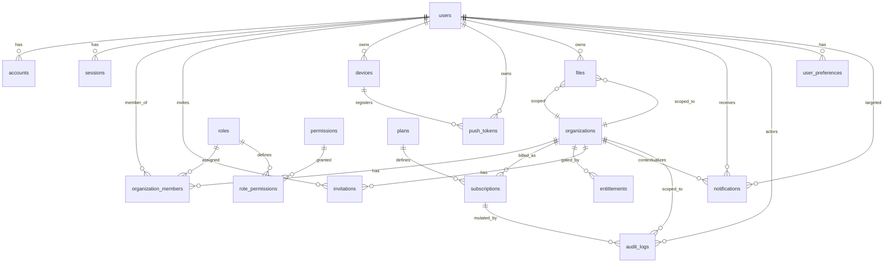

# Phase 3 — ERD (Product Layer)

> Delta to [`docs/erd.md`](./erd.md) and [`docs/phase-0-technical-decisions.md`](./phase-0-technical-decisions.md) §4.
> Additive only — the 18 tables at `48e0dd3` are not renamed or deleted. Phase 3.1 added `entitlements`; Phase 3.2 added invitation lifecycle columns/indexes; Phase 3.3 added `user_preferences`; Phase 3.4 added file lifecycle metadata/indexes; Phase 3.5 added notification context and push-token lifecycle metadata; Phase 3.6 adds the server-authoritative analytics consent column. New columns/tables are nullable or defaulted so existing rows remain valid. All IDs remain `text` (`cuid2`).

## Visual (Phase 3 — org-scoped SaaS)

## Tables (diff)

### users (delta)

| col | change | notes |
|-----|--------|-------|
| image | unchanged and canonical | Existing Better Auth image/avatar reference; no duplicate `avatar_url` |
| deleted_at | **DEFERRED** | Soft-delete/grace lifecycle requires auth-aware sign-in/session changes not present in this milestone |
| updated_at | unchanged | |

### user_preferences (implemented in Milestones 3.3 and 3.6)

| col | type | constraints |
|-----|------|-------------|
| user_id | text | pk, fk users.id cascade |
| locale | enum `locale` | `en` \| `de`, default `en` |
| theme | enum `theme` | `system` \| `light` \| `dark`, default `system` |
| marketing_opt_in | boolean | default false |
| analytics_enabled | boolean | default true; distinct from marketing consent; server-authoritative product analytics opt-out |
| invite_emails | boolean | default true |
| billing_alerts | boolean | default true |
| quiet_hours_start | text nullable | strict `HH:MM`, paired with end |
| quiet_hours_end | text nullable | strict `HH:MM`, paired with start |
| updated_at | timestamptz | not null, default now() |

One row per user, `user_id` is PK. Rows are created lazily with safe defaults by `settings.getPreferences`; no destructive backfill.

### subscriptions (delta)

| col | change |
|-----|--------|
| trial_ends_at | ADD `timestamptz nullable` |
| grace_ends_at | ADD `timestamptz nullable` |
| cancel_at_period_end | ADD `boolean default false` |
| provider_status | ADD `text nullable` (raw provider status) |
| status | unchanged enum `subscription_status` |
| provider_subscription_id | unchanged |
| current_period_end | unchanged |

Constraints (app layer preferred, or PG check):

- `check (status='trialing' → trial_ends_at not null)`
- `check (grace_ends_at is null or grace_ends_at > created_at)`

### entitlements (new)

| col | type | constraints |
|-----|------|-------------|
| id | text | pk, cuid2 |
| organization_id | text | fk organizations.id cascade, indexed |
| feature | text | not null (e.g. `projects.limit`, `members.limit`, `storage.gb`, `ai.tokens`) |
| limit | integer nullable | null = unlimited |
| enabled | boolean | default true |
| created_at | timestamptz | not null, default now() |
| updated_at | timestamptz | not null, default now() |
| **unique** | | (organization_id, feature) |

Seeded per org from `plans` defaults; admin toggles override.

### invitations (delta)

| col | change | notes |
|-----|--------|-------|
| status | ADD `enum invitation_status` (`pending`,`accepted`,`revoked`,`expired`) default `pending` | Lifecycle beyond `expiresAt`; `revoked` with audit `reason=declined` represents an invited user's decline without adding a fifth enum value |
| responded_at | ADD `timestamptz nullable` | When accepted/revoked/expired |
| code | **NOT IMPLEMENTED** | Rejected in Milestone 3.2; the cryptographically random token/deep link is sufficient and avoids a second brute-force redemption path |
| token | unchanged unique; new tokens are 32 random bytes encoded as 64 hex chars | Existing tokens remain valid |
| role, email, organization_id, invited_by, expires_at | unchanged | |

Indexes:

- `unique(organization_id, email) where status='pending'` — at most one pending invite per normalized email per org (API trims/lowercases before lookup/insert).
- `index(invitations, organization_id)` for list/revoke operations.

### files (implemented in Milestone 3.4)

| col | change | notes |
|-----|--------|-------|
| status | ADD enum `file_status` (`pending`,`ready`,`deleted`) default `pending` | Server-only lifecycle; client cannot set terminal state |
| expires_at | ADD `timestamptz nullable` | Pending reservation/orphan horizon |
| updated_at | ADD `timestamptz not null default now()` | Lifecycle updates |
| organization_id | unchanged nullable | Null means user-private; non-null requires membership/RBAC |
| user_id | unchanged required | Owning/creating user |
| content_type, size | unchanged nullable | New uploads require validated values |
| url | unchanged required | Private rows retain an opaque object reference; not treated as public URL |

Indexes added: `files_user_idx`, `files_org_idx`, `files_status_idx`; existing unique `key` remains.

Lifecycle: `pending` → provider HEAD-confirmed `ready` → remote-delete-confirmed `deleted`. Expired pending rows are handled by the cleanup service; scheduled GC is deferred.

Constraints: new upload policy requires `size > 0`, supported MIME, and `size <= 10485760` (10 MiB). Organization quota uses `storage.gb` plus non-expired pending reservations.

### push_tokens (implemented in Milestone 3.5)

| col | change | notes |
|-----|--------|-------|
| invalidated_at | ADD `timestamptz nullable` | Rotated, logged-out, and provider-invalid tokens are excluded from delivery |
| token unique | unchanged | Global deduplication remains |

Indexes added: `push_tokens_device_idx`, `push_tokens_user_active_idx`.

### notifications (implemented in Milestone 3.5)

| col | change | notes |
|-----|--------|-------|
| category | ADD `text not null default 'system'` | Server finite union: `team`, `billing`, `security`, `system` |
| organization_id | ADD `text nullable fk organizations.id set null` | Context only; list/read always remains user-scoped |
| data | unchanged `jsonb` | API accepts only `{ route?: string, orgId?: string }` after allowlist validation |
| user_id, title, body, read_at, created_at | unchanged | In-app history remains independent of push delivery |

Indexes added: `notifs_user_read_created_idx`, `notifs_org_idx`; existing `notifs_user_idx` remains.

### audit_logs (delta)

| col | change |
|-----|--------|
| idempotency_key | ADD `text nullable unique` |
| target_type, target_id, metadata | unchanged jsonb |

### No change (reaffirmed)

`accounts`, `sessions`, `organizations`, `organization_members`, `roles`, `permissions`, `role_permissions`, `plans`, `devices` — no column added/removed/renamed in Phase 3. Any future change to these requires an ADR update.

## Notes

- All new enums use `pgEnum` so Drizzle can generate reversible migrations; existing enums are not altered.
- All FKs use `onDelete: cascade` for owned data and `set null` for audit survival — unchanged.
- RLS is not enabled in V1; authorization is enforced in `packages/api` via `assertCan()` before any write — DB constraints are safety nets, not the policy engine.
- Any `text` FK that previously lacked an index gains one via Drizzle's `(t) => [index(...)]` when it becomes a hot path (e.g. `entitlements.organization_id`).

## Migrations

Generated by `pnpm --filter @repo/database db:generate` after editing `packages/database/src/schema.ts`.

- [x] `0004_real_boomerang.sql`, `0005_many_virginia_dare.sql`, and `0006_high_jazinda.sql` reviewed and applied locally
- [x] No `dropTable` / `dropColumn` for the existing 18-table schema
- [x] All new columns are nullable or have safe defaults so existing rows migrate
- [x] Generated migrations are human-readable and match their ERD deltas
- [x] Regeneration after application reports no schema changes
- [ ] CI runs `pnpm --filter @repo/database db:generate` followed by a clean-tree migration snapshot check as its drift detector.
